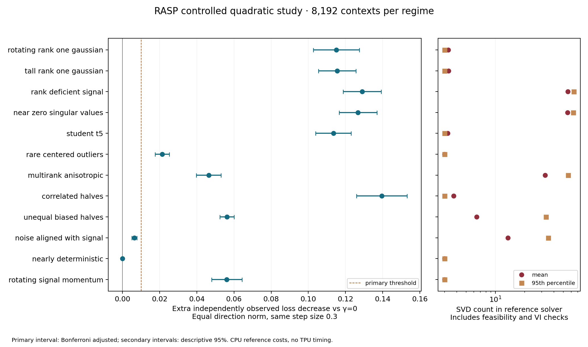

# Executed Phase 02 results — r001

**Scope:** controlled quadratic mechanisms, 2026-10-01. No language model, TPU
kernel or source training benchmark was run. Phase 01 and Phase 02 pass their
mathematical and mechanism gates. Primitive novelty and peer training superiority
remain unestablished.

## Design and audit

The protocol and evaluator were committed at `b611be4` before any development
draws. Development selections were committed at `9c7b8a5` before final draws.
See `phase02/protocol.{json,md}`, `phase02/run-v1/freeze.json` and the final
manifest for full hashes. PCG64, NumPy 2.2.6; seeds 20261001–20261005. Seeds
42–44 were never used. Each of 12 laws has 1,024 development contexts and 8,192
fresh final contexts. All laws, fixed n, thresholds and stopping rules were
specified beforehand; no final observation selected a parameter or stopped a run.

A second complete replay reproduced all development selections, final statistics
and all twelve raw file SHA256 hashes exactly (`reproduction-checks.json`).

Independent evaluation half-errors were fresh draws, shared across methods
within each context. Reported loss decrease uses the identity-Hessian quadratic.
The primary endpoint fixes η=0.3 and unit Frobenius update norm. This is also
feasible in the actual radius-one matrix operator ball. Any scalar damping of
the γ=0 direction gives the same normalized direction, so this endpoint isolates
direction. Separate raw outcomes use the development-selected stepsizes.

The intended law has a rotating **vectorized rank-one covariance direction** v
orthogonal to the unit signal g, with two independent N(0,9) scalar half-errors
along v. One nonzero disagreement identifies that direction exactly. This is a
strong, constructed observability condition; real training noise need not have
this structure. RASP sees M,E and never sees g,v or evaluation observations.

All 30 Python tests pass. Twenty saved independent CLARABEL matrix-cone solves
agree with the scalar solver: largest objective discrepancy **8.19e-10**,
largest direction distance **5.88e-6**. The formal 2×2 gap 1/9, zero radius,
rank deficiency, repeated/near-zero singular values, wide/tall matrices and
extreme scales pass. VI gaps use `<R,D>+r||R||nuclear`, from spectral/trace
duality ([Lewis, Eq.1.1 and Example 3.3](https://people.orie.cornell.edu/aslewis/publications/95-convex.pdf));
this is an independent numerical evaluator, not a verified SVD implementation.

The known Gaussian second-moment interval covered 4.5 in **286/300** independent
repetitions: **95.33%**, binomial MCSE **1.22 percentage points**. It passes the
frozen 90–99% diagnostic range. This does not certify coverage for every
nonlinear endpoint. Three new finite-arithmetic Lean lemmas support the adaptive
counterexample below; the complete final audit covers **64 public theorems**
plus `matrixStep`, with only standard Lean axioms.

## Primary mechanism decision

Development selected γ=1000 and raw η=0.6; primary η remains fixed at 0.3.
The three paired intervals below each have 98.333% coverage (Bonferroni joint
95%). All lower limits exceed the frozen **0.01** absolute loss-decrease gate.

| RASP minus control, matched norm and η | Independent decrease difference | MCSE | Adjusted interval |
|---|---:|---:|---:|
| γ=0 | 0.11505 | 0.00516 | [0.10269, 0.12742] |
| Shuffled E from independent donor contexts | 0.11356 | 0.00504 | [0.10151, 0.12562] |
| Same-norm independent random E | 0.11330 | 0.00503 | [0.10127, 0.12534] |

The exact conditional progress contrast versus γ=0 is 0.12042, MCSE 0.00086,
adjusted interval [0.11837,0.12247]. Independent observations agree within their
uncertainty. This supports useful **orientation information** locally, beyond
scalar damping and marginal disagreement magnitude. It is not a convergence
theorem or a neural training result.

## Full law outcomes and cost

Each law uses its own development-selected γ. The secondary intervals are
descriptive 95%, without a familywise superiority claim. Full true/independent
outcomes, paired MCSEs, norms, surrogate and fresh-risk measurements for every
map are in `phase02/run-v1/final/results.json` and `phase02-summary.csv`.

| Law | γ | Extra independent decrease vs γ=0, matched | Interval | Mean / p95 SVD count |
|---|---:|---:|---:|---:|
| Rotating rank-one Gaussian (primary) | 1000 | 0.11505 | [0.10269,0.12742], adjusted | 3.27 / 3 |
| Tall Gaussian | 1000 | 0.11552 | [0.10545,0.12560] | 3.29 / 3 |
| Rank-deficient signal | 1000 | 0.12896 | [0.11873,0.13919] | 55.42 / 64 |
| Near-zero singular values | 1000 | 0.12673 | [0.11653,0.13693] | 55.14 / 63 |
| Student-t5 | 1000 | 0.11348 | [0.10387,0.12308] | 3.23 / 3 |
| Centered rare outliers | 1000 | 0.02138 | [0.01756,0.02521] | 3.01 / 3 |
| Multirank anisotropic | 100 | 0.04640 | [0.03973,0.05306] | 32.35 / 56 |
| Correlated halves, ρ=0.8 | 1000 | 0.13952 | [0.12587,0.15317] | 3.73 / 3 |
| Unequal biased halves | 1 | 0.05625 | [0.05244,0.06007] | 6.44 / 33 |
| Noise aligned with signal | 0.1 | 0.00633 | [0.00494,0.00771] | 13.47 / 35 |
| Nearly deterministic | 0 | 0 | [0,0] | 3 / 3 |
| Rotating signal, momentum β=0.9 | 1000 | 0.05608 | [0.04792,0.06425] | 3.00 / 3 |

Minimum SVD count is three: a feasibility SVD plus two final certificate SVDs.
These are not three root projections. 99.10% of primary contexts used the
unconstrained rank-one inverse; the active rank-deficient cases did not. Dense
bisection is rejected as the proposed production implementation. A post-study
Brent cost repair on the fixed first 512 contexts reduces rank-deficient mean
SVDs 55.23→19.50 and multirank 31.95→12.02, while maximum direction discrepancy
is below 9e-10 and VI checks pass. These are **exploratory numerical work counts**,
not new primitives or hardware speedups; original evidence is retained unchanged.

A credible kernel must exploit certified inactive checks and use justified
approximate projections for active blocks. Approximation bounds exist; numerical
primitive and end-to-end cost certification do not. Active work and extra
communication remain serious gates for Phase 05; no dense-solver TPU
competitiveness has been accepted. The reference MC took 85.98 seconds on this
CPU environment, including saving raw evidence; it is not optimizer throughput.

## Negative evidence and hypothesis updates

- **Adaptive calibration fails.** In the primary law, normalized RASP's realized
  surrogate mean is **2.845e-5**, while fresh mean-noise risk is **0.04597**.
  Fixed-direction means, 2.22359 and 2.25234, agree within uncertainty. Exact
  finite iid ±1 arithmetic gives realized adaptive surrogate **0** and fresh
  adaptive risk **1/4**. Lean proves those four-cell averages. Realized suppression
  cannot be marketed as an unbiased adaptive-risk estimate.
- **Correlated replicas violate magnitude calibration.** For ρ=0.8 the fixed
  direction gives disagreement 0.44285 versus mean-error 4.07031; paired
  difference −3.62745, interval [−3.75451,−3.50040]. Orientation can still help
  here. Independent unequal *centered* variances alone need not break equality
  between G and E second moments; our unequal law also introduces biases.
- **Dependent replicas can harm.** An additional deterministic matrix attack
  has g=diag(0.6,0.8), A=g+diag(1,0), B=g−diag(1,0), so their mean is noiseless.
  At γ=3, D=diag(0.15,0.8) is feasible with computed VI gap zero. Equal-norm
  progress drops by **0.03094** versus γ=0. This numerical counterexample is
  outside the iid premise and explicitly retained in `solver-attack.json`.
- **Signal-aligned uncertainty weakens the prediction.** Development chooses
  γ=0.1, and the gain is below the primary 0.01 threshold. Transferring γ=1000
  has an inconclusive independent contrast (−0.00255, MCSE 0.00640). Do not
  claim a statistically demonstrated reversal from this MC law.
- **Rank-one coverage is limited.** In multirank noise, matched RASP progress
  is 0.14554 versus unattainable population-covariance oracle 0.25500. Oracle
  information is never supplied to RASP or used for its tuning.
- **Momentum covariance differs.** β=0.9, 32-step momentum noise squared norm
  averages 0.23079 (interval [0.22360,0.23799]); its theoretical stationary-law
  calibration is about 0.23656. Current raw E has squared norm near 4.5, not
  momentum variance. Rotating-signal bias is separate from noise variance.

H1 is supported in its named observable regime. H0/H3 do not explain that
norm-matched directional gain; they remain competitive explanations in other
laws. H2 gains motivation from the multirank oracle gap but no implementable
sketch was selected. Efficiency and broad superiority remain unresolved.

## Peer interpretation and raw evidence

The primary one-step maps include tuned SGD, AdamW first-step algebra, ideal
polar, finite NS5 in float64, hard/soft spectral maps and HT SVD. Each gets the
same 24 development parameter/stepsize evaluations (duplicates retained for
parameter-free maps). RASP has positive descriptive paired primary contrasts
against them; these are local mathematical-map comparisons. For momentum
attacks, the maps act on the same supplied M rather than pretending to reproduce
each peer's full historical state. SOAP first-step skip is recorded as a state
boundary diagnostic and excluded from any substantive competitive conclusion.
No full Muon/AdamW/SOAP/Dion or all-peer training parity is asserted.

All **98,304** final contexts and paired directions/outcomes are saved in 12
compressed raw files, **449,061,360 bytes**, locally at
`research/r001/phase02/run-v1/final/*.npz`. Repository instructions exclude data
from Git. An evidence archive is prepared for draft GitHub release
`r001-phase01-02`; `raw-storage.json` records its size, SHA256 and storage status.
The pushed manifest records individual SHA256 hashes; frozen code, seeds,
dependency versions and commands regenerate them. `raw-audit.json` verifies
every hash and recomputes paired summaries. Source snapshots similarly remain
in ignored `.source-cache`, with retrievable URLs and hashes.
